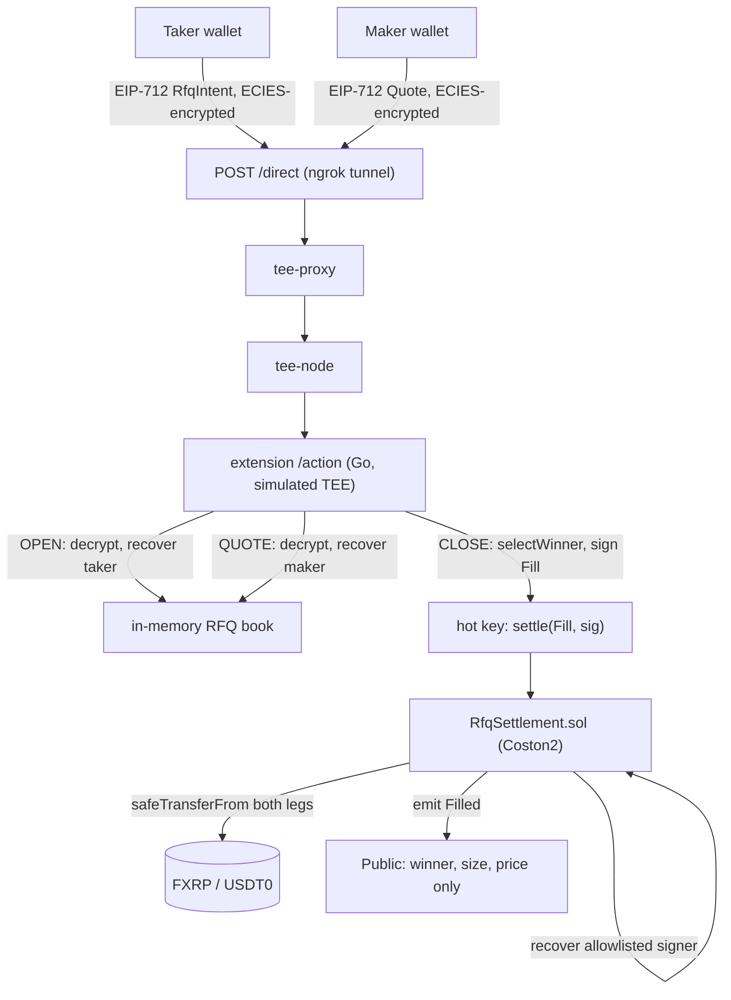

# FXRP Dark RFQ

Sealed-bid RFQ matcher for FXRP that matches privately inside a Flare Confidential Compute TEE, settling atomically on Coston2.

[](contracts/src/RfqSettlement.sol)
[](frontend/package.json)
[](https://coston2-explorer.flare.network)
[](contracts/test/RfqSettlement.t.sol)

Built for [Flare Summer Signal](https://dorahacks.io/hackathon/flaresummersignal/detail) — Bounty 2 (Confidential Compute) primary, Bounty 1 (Interoperable Assets / FXRP) as integration proof.

## Demo

<!-- TODO: Add demo.gif — screen capture of taker opening an RFQ, two makers quoting different prices on /maker, taker closing, and the Filled event confirming on /taker -->

No video yet. In the meantime, here's a real, independently-checkable fill this system produced — not a mock:

> **[`0xe158ffe7...a7a8e9`](https://coston2-explorer.flare.network/tx/0xe158ffe70bd1df2790ca3bc09c501cf214f6c7a7406872882361698551a7a8e9)** — a taker buying 1 FXRP, two makers quoting 2.95 and 2.99 USDT0, the TEE selecting the cheaper of the two, both ERC-20 legs settling atomically in one transaction.

Produced by [`frontend/scripts/e2e-demo.mts`](frontend/scripts/e2e-demo.mts), which drives the same `lib/eip712.ts`, `lib/rfqClient.ts`, and `lib/quoteAmount.ts` the UI itself calls — not a reimplementation.

## Overview

An RFQ desk leaks information by design: a public limit order book shows your size and price to everyone before you trade. FXRP Dark RFQ keeps the taker's limit price and every losing quote inside a Flare Confidential Compute (FCC) TEE extension — the chain only ever learns the winning fill, after the fact. Matching logic (best-price selection against a taker's sealed limit) runs off-chain inside the TEE; settlement is a single atomic on-chain transaction that a Solidity contract executes once it verifies the TEE's own attestation signature over the fill.

## Features

- **Sealed-bid matching** — taker limit price and losing maker quotes never touch the chain or a public order book; only the winning `Filled` event is public
- **Atomic on-chain settlement** — both ERC-20 legs (FXRP and USDT0) transfer in one transaction once the TEE-signed `Fill` is verified
- **EIP-712 everywhere** — `RfqIntent`, `Quote`, and `Fill` share one domain, cross-checked against the live contract's own `hashFill` to rule out signature-portability bugs
- **Browser-safe ECIES** — a from-scratch port of go-ethereum's `crypto/ecies` (not a generic library) so the browser can encrypt directly to the TEE's pubkey; verified byte-for-byte against the live running TEE
- **Real funded proof** — `scripts/e2e-demo.mts` runs the full OPEN → QUOTE ×2 → CLOSE → `Filled` flow against live Coston2 state through the actual production code paths
- **10/10 Foundry tests** — decimal math (including the real 6/6 FXRP/USDT0 pair), replay/expiry/untrusted-signer guards, and FTSO-bound logic against a mocked feed

## Architecture



Only step `K` is ever public. Everything above it — limit price, losing quotes, non-winning maker identities — stays inside the TEE.

## Tech stack

| Component | Technology |
|---|---|
| Settlement contract | Solidity 0.8.24, Foundry, OpenZeppelin |
| Confidential compute | Flare Confidential Compute (FCC), Go extension, simulated TEE mode |
| Frontend | Next.js 16 · React 19 · wagmi · viem |
| Crypto | EIP-712 typed signing · ECIES (browser-safe port of go-ethereum's scheme) |
| Network | Flare Coston2 testnet |
| Assets | FXRP · USDT0 |

## Quickstart

Requires Node 20+ and three funded Coston2 wallets (taker + 2 makers).

```bash
git clone https://github.com/Cassxbt/fxrp-dark-rfq
cd fxrp-dark-rfq/frontend
npm install
npm run dev
```

Open `/taker` and `/maker` — see [Usage](#usage) below.

## Configuration

| Variable | Description | Required |
|---|---|---|
| `NEXT_PUBLIC_EXT_PROXY_URL` | URL of the FCC extension's proxy (`/info`, `/direct`) | No — falls back to the current default in `frontend/lib/contracts.ts` |

The extension and its ngrok tunnel are already running against Coston2 for judging; see **Judge testing notes** below before relying on the live tunnel.

## Usage

1. **Taker** (`/taker`): connect a Coston2 wallet, pick buy/sell + size + limit price, click **Open RFQ** (approve, then sign). A shareable blob appears — `RFQ 0x... — taker is BUYING/SELLING X FXRP` — since there's no public listing.
2. **Makers** (`/maker`, 2 different wallets): paste the RFQ ID, match the stated side/size, enter a price, click **Submit Quote** (approve, then sign). Use two different prices — this is what proves selection is happening, not pass-through.
3. **Taker**: click **Close RFQ**. The UI polls the contract's `settled()` for up to ~30s and reports success or an explicit failure reason. A confirmed fill shows the winning maker, size, and price, pulled from the on-chain `Filled` event.

To reproduce the funded proof above without a browser:

```bash
cd frontend
npx tsx --env-file=.env.e2e.local scripts/e2e-demo.mts
```

(Needs three funded private keys in a local, gitignored `.env.e2e.local` — see the script for the exact variable names.)

## Deployed contracts

| Contract | Network | Address |
|---|---|---|
| `RfqSettlement.sol` | Coston2 | [`0xaBf47C48c00DDa806f1d9243c936A8153C7E6FcE`](https://coston2-explorer.flare.network/address/0xaBf47C48c00DDa806f1d9243c936A8153C7E6FcE) |
| FXRP | Coston2 | [`0x0b6A3645c240605887a5532109323A3E12273dc7`](https://coston2-explorer.flare.network/address/0x0b6A3645c240605887a5532109323A3E12273dc7) |
| USDT0 | Coston2 | [`0xC1A5B41512496B80903D1f32d6dEa3a73212E71F`](https://coston2-explorer.flare.network/address/0xC1A5B41512496B80903D1f32d6dEa3a73212E71F) |

Proof-of-fill transaction: [`0xe158ffe7...a7a8e9`](https://coston2-explorer.flare.network/tx/0xe158ffe70bd1df2790ca3bc09c501cf214f6c7a7406872882361698551a7a8e9).

## Known limitations

- **No FTSO price bound is active on this deployment.** The contract supports one (owner-configurable, covered by 3 passing tests), but it was never turned on — `ftso()` reads as the zero address, and the bound check short-circuits when unset. Every fill, including the one linked above, settled on the taker's limit and the maker's quote only, with no oracle check.
- **Simulated TEE, not hardware-attested.** This deployment runs FCC's officially-sanctioned simulated mode. The signer key's trustworthiness rests on the extension process, not a hardware attestation chain.
- **`isAttestedSigner` is an owner-controlled allowlist**, not a live read of FCC's `TeeExtensionRegistry`. That registry's exact ABI wasn't confirmed against the deployed scaffold in time for this submission.
- **`CLOSE` is unauthenticated.** Any address can trigger matching for any open RFQ ID, not just the taker who opened it. Since IDs aren't listed publicly and closing early just picks among whatever quotes exist so far, this is a disclosed scope cut, not an oversight — don't rely on it being taker-only.
- **On-chain settlement is asynchronous from the `CLOSE` call** (FCC's response window doesn't fit a chain round trip). The taker UI polls `settled()` and reports success/failure explicitly rather than leaving the call looking like it hung.
- **The contract verifies only the TEE's `Fill` signature**, not the underlying `RfqIntent`/`Quote` signatures a second time — those are checked once inside the extension.

### Judge testing notes

The FCC extension is reachable through an ngrok tunnel whose URL is hardcoded as a fallback default in `frontend/lib/contracts.ts` — it goes dead if the host machine sleeps or the tunnel restarts. If `/taker` or `/maker` can't reach `/info`, the live tunnel is likely down; the proof-of-fill transaction above and `scripts/e2e-demo.mts`'s output remain valid evidence independent of tunnel uptime. Reach out if you want the tunnel confirmed live before you test.

## Repo layout

- `contracts/` — `RfqSettlement.sol` + Foundry tests (10 passing)
- `extension/` — Go FCC extension: RFQ intake, matching, TEE-signed settlement submission
- `frontend/` — Next.js taker/maker UI + `scripts/e2e-demo.mts`

## Contributing

This is a hackathon submission built under deadline; not currently accepting external contributions. Open an issue if you spot something.

## License

No license file included in this submission — all rights reserved by the author unless stated otherwise.
