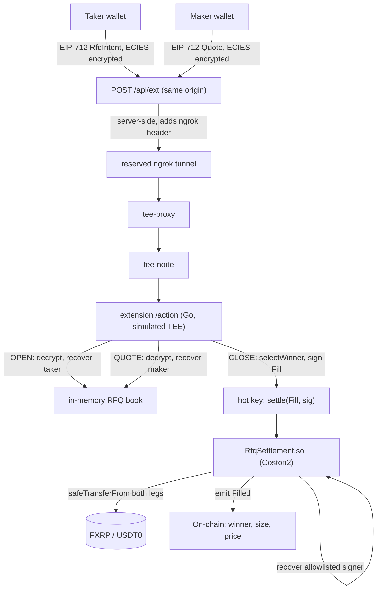

# FXRP Dark RFQ

Sealed-bid RFQ matcher for FXRP that matches privately inside a Flare Confidential Compute TEE, settling atomically on Coston2.

[](contracts/src/RfqSettlement.sol)
[](frontend/package.json)
[](https://fxrp-dark-rfq.vercel.app)
[](https://coston2-explorer.flare.network)
[](https://github.com/Cassxbt/fxrp-dark-rfq/actions/workflows/test.yml)

## Demo

Both directions, settled on Coston2 and independently checkable — not mocks:

| Side | Size | Quotes seen | Filled at | Transaction |
|---|---|---|---|---|
| Taker **buy** | 1 FXRP | 2.95 · 2.99 | **2.95** (lowest wins) | [`0xe158ffe7…`](https://coston2-explorer.flare.network/tx/0xe158ffe70bd1df2790ca3bc09c501cf214f6c7a7406872882361698551a7a8e9) |
| Taker **sell** | 1 FXRP | 2.55 · 2.60 | **2.60** (highest wins) | [`0x92d60cc4…`](https://coston2-explorer.flare.network/tx/0x92d60cc432e423fc6f37cd3de95ab3f7620efdf4f64f2bbe17a13652c1cbed01) |

Two makers competed on each, and the winner flips with the side — which is the
point: the enclave ranks against the taker's sealed limit rather than passing
through whatever single quote arrived. Both ERC-20 legs move atomically in one
transaction.

Produced by [`frontend/scripts/e2e-demo.mts`](frontend/scripts/e2e-demo.mts), which drives the same `lib/eip712.ts`, `lib/rfqClient.ts`, and `lib/quoteAmount.ts` the UI itself calls.

Submitted to [Flare Summer Signal](https://dorahacks.io/hackathon/flaresummersignal/detail): Bounty 2 (Confidential Compute) primary, Bounty 1 (Interoperable Assets / FXRP) as integration proof.

## Overview

An RFQ desk leaks information by design: a public limit order book shows your size and price to everyone before you trade. FXRP Dark RFQ keeps the taker's limit price and every losing quote inside a Flare Confidential Compute (FCC) TEE extension — the chain only ever learns the winning fill, after the fact. Matching logic (best-price selection against a taker's sealed limit) runs off-chain inside the TEE; settlement is a single atomic on-chain transaction that a Solidity contract executes once it verifies the TEE's own attestation signature over the fill.

## Features

- **Sealed-bid matching** — taker limit price and losing maker quotes never touch the chain or a public order book; only `Filled` is on-chain
- **Atomic on-chain settlement** — both ERC-20 legs (FXRP and USDT0) transfer in one transaction once the TEE-signed `Fill` is verified
- **Real assets** — live FXRP and USDT0 on Coston2, not toy ERC-20s
- **Real funded proof** — `scripts/e2e-demo.mts` runs the full OPEN → QUOTE ×2 → CLOSE → `Filled` flow against live Coston2 state through the actual production code paths, not a simulation

## Architecture



The taker's limit price and every losing quote never leave the TEE's encrypted
boundary — only the winning `Filled` event reaches the chain. That's a
narrower claim than "nothing else is ever visible": the `/direct` HTTP layer
itself is unauthenticated, and `OPEN`'s result exposes `{rfqId, side, size}`
in cleartext to anyone polling it — see Known limitations and
[`docs/TRUST.md`](docs/TRUST.md).

Solidity 0.8.24 (Foundry, OpenZeppelin) · Go FCC extension, simulated TEE ·
Next.js 16 with wagmi/viem.

## How to verify

**The two explorer transactions above are the evidence of record.** They
settled on a public chain and stay checkable whether or not anything of ours
is running. Read each `Filled`'s args, then the two ERC-20 `Transfer` logs
beside it — and note the winner flips between the buy and the sell.

To read the code behind it: [`rfq.go`](extension/go/internal/extension/rfq.go)
matches inside the TEE, [`RfqSettlement.sol`](contracts/src/RfqSettlement.sol)
settles. `forge test` and `go test ./...` both run in
[CI](https://github.com/Cassxbt/fxrp-dark-rfq/actions/workflows/test.yml).

The live app is deployed at **[https://fxrp-dark-rfq.vercel.app](https://fxrp-dark-rfq.vercel.app)**.

It is a secondary path, and honestly so: the UI is on Vercel, but the FCC
extension itself runs in Docker on a dev machine behind an ngrok tunnel. The
browser never calls that tunnel directly — the extension's proxy sends no CORS
headers and ngrok's free tier serves an interstitial to browser User-Agents, so
requests go through a server-side route (`app/api/ext/[...path]`) that forwards
them. The tunnel URL is the `EXT_PROXY_ORIGIN` env var, not baked into the
bundle.

The tunnel address is stable (a reserved ngrok domain), so it survives
restarts — but the enclave itself does not run in the cloud. Opening or quoting
needs that machine awake, with Docker and the tunnel up, plus three funded
Coston2 wallets. If the app reports the extension unreachable, that is what
happened, and nothing about the fills above changes: they are settled on a
public chain and stay checkable regardless. Running it locally is the same
picture — `cd frontend && npm install && npm run dev`.

Driving it: the taker opens (approve, sign) and gets an RFQ ID to hand to
makers out of band, since there's no public listing. Two makers quote it at
different prices — that difference is what shows selection is real rather than
pass-through. The taker closes; the UI polls `settled()` for ~30s and then
reads the `Filled` event back.

### Reproducing the funded proof (maintainers)

```bash
cd frontend
cp .env.e2e.local.example .env.e2e.local   # fill in three funded burner keys
npx tsx --env-file=.env.e2e.local scripts/e2e-demo.mts
```

Bypasses the browser entirely, calling the same `lib/` code directly. This is
what produced the transaction linked under Demo above.

## Deployed contracts

| Contract | Network | Address |
|---|---|---|
| `RfqSettlement.sol` | Coston2 | [`0xaBf47C48c00DDa806f1d9243c936A8153C7E6FcE`](https://coston2-explorer.flare.network/address/0xaBf47C48c00DDa806f1d9243c936A8153C7E6FcE) |
| FXRP | Coston2 | [`0x0b6A3645c240605887a5532109323A3E12273dc7`](https://coston2-explorer.flare.network/address/0x0b6A3645c240605887a5532109323A3E12273dc7) |
| USDT0 | Coston2 | [`0xC1A5B41512496B80903D1f32d6dEa3a73212E71F`](https://coston2-explorer.flare.network/address/0xC1A5B41512496B80903D1f32d6dEa3a73212E71F) |

Proof-of-fill transactions: [buy `0xe158ffe7…`](https://coston2-explorer.flare.network/tx/0xe158ffe70bd1df2790ca3bc09c501cf214f6c7a7406872882361698551a7a8e9) · [sell `0x92d60cc4…`](https://coston2-explorer.flare.network/tx/0x92d60cc432e423fc6f37cd3de95ab3f7620efdf4f64f2bbe17a13652c1cbed01).

## Known limitations

- **No FTSO price bound is active on this deployment.** The contract supports one (owner-configurable, covered by 3 passing tests), but it was never turned on — `ftso()` reads as the zero address, and the bound check short-circuits when unset. Every fill, including the one linked above, settled on the taker's limit and the maker's quote only, with no oracle check.
- **Simulated TEE, not hardware-attested.** This deployment runs FCC's officially-sanctioned simulated mode. The signer key's trustworthiness rests on the extension process, not a hardware attestation chain.
- **`isAttestedSigner` is an owner-controlled allowlist**, not a live read of FCC's `TeeExtensionRegistry`. That registry's exact ABI wasn't confirmed against the deployed scaffold in time for this submission.
- **`CLOSE` is unauthenticated**, and the `/direct` HTTP layer that carries OPEN/QUOTE/CLOSE has no authentication at all. Any address can trigger matching for any open RFQ ID. `OPEN`'s result also returns `{rfqId, side, size}` in cleartext to anyone polling it — side and size are not as tightly held as the on-chain summary alone would suggest, though the limit price and losing quotes never leave the TEE. Disclosed scope cuts, not oversights.
- **On-chain settlement is asynchronous from the `CLOSE` call** (FCC's response window doesn't fit a chain round trip). The taker UI polls `settled()` and reports success/failure explicitly rather than leaving the call looking like it hung.
- **The contract verifies only the TEE's `Fill` signature**, not the underlying `RfqIntent`/`Quote` signatures a second time — those are checked once inside the extension.
- **`/api/ext/*` is an unauthenticated relay.** The browser cannot reach the extension directly (no CORS headers, plus ngrok's interstitial), so the deployed app forwards through its own server route. That route adds no auth of its own — it is the same trust model as the raw tunnel, just easier to find. The matcher behind it is equally unauthenticated by design; see `CLOSE` above.
- **The extension is served through a laptop ngrok tunnel**, not infrastructure. The UI is deployed, the enclave is not — it dies when the host sleeps. The RFQ book is in-memory too, so a restart wipes open RFQs.

## Repo layout

- `contracts/` — `RfqSettlement.sol` + Foundry tests (10 passing)
- `extension/` — Go FCC extension: RFQ intake, matching, TEE-signed settlement submission (deploy/ops runbook in `extension/ops.md`)
- `frontend/` — Next.js taker/maker UI + `scripts/e2e-demo.mts`
- `docs/TRUST.md` — trust model detail beyond the Known limitations above

## License

MIT — see [`LICENSE`](LICENSE).
